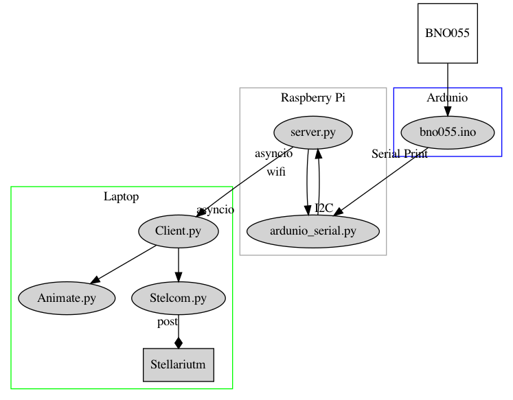

# Sensors_telescope
Sensor package for positioning telescope, to track targets, interfacing with astronomy software (Stellarium). 


## BNO055 Board layout and orientation:
         +----------+
         |         *| RST   PITCH  ROLL  HEADING
     ADR |*        *| SCL
     INT |*        *| SDA     ^            /->
     PS1 |*        *| GND     |            |
     PS0 |*        *| 3VO     Y    Z-->    \-X
         |         *| VIN
         +----------+


# Design

## Hardware configuration choice 

The initial strategy was to connect the BNO055 to a Raspberry Pi via I2C.  Although it was easy enough to get data from the sensor package the values were erratic.  Several approaches were taken too, speed up data collection, take larger samples followed by averaging and also to carry the data in quaternions and calculate the Euler angels in the last step. It seems the I2C connection is perhaps not fast enough to collect the useful measurements.

A second strategy it was much more successful. This was using an I2C connection via an Arduino and a USB connection between the Arduino and a Raspberry Pi.  The data return was very steady.   The demo Arduino scripts were more than sufficient to return the heading, pitch and yaw (azimuth, altitude and tilt) along with some data quality indicators. 

## Data choice 
The BNO055 outputs several types of direct measurements (Mag, Gyro, Acc, etc) and two sets of derived information, Euler Angles and Quaternions.  A quick review of literature suggests that Euler Angles can be problematic, and it is best to use quaternions in any data manipulations only converting to Euler angels in the last steps. 
This does not see to hold for the BNO055.  Initially data was erratic prompting a strategy of averaging the output.  The output is received in multi layer dictionary structures, so a utility was written to flatten the dictionary and average them (utils/flatten_dict.py).  Another utility was written to convert quaternions to Euler angels (utils/quaternion.py). 

The Euler angles output it from the sensor seem to be quite stable and correspond well with the orientation of the chip.  the decision was made to use the output from the chip directly ignoring the quaternions for now. It is worth investigating the processing done on the microprocessor of the BNO055 there appears to be some smoothing in the output data evidenced by its stability. 

When the Euler angles are sent Stellarium they must first be inverted by multiplying by -1 and then converting into radians 

## Python Choice 

Python 3.8 is used in order to access asyncio functions.

An installation was created here:
```
/home/pi/Python-3.8.5
```

There are two installations of Python on this Raspberry Pi 3.5 is the standard which can be accessed by  $ python <>.py.  There is also an installation of Python 3.8 (home/pi/Python-3.8.5 which can be accessed with python38. <>.py.  The alias of this second installation is controlled in bashrc.
```
sudo nano /home/pi/.bashrc
```


the following line was added at the end of the file: 
```
alias python38="/home/pi/Python-3.8.5/python"
```


The reason for doing this was to access functionality in the asyncio package, specifically the. run method of that package. Running under early versions of python causes this error: 

AttributeError: module 'asyncio' has no attribute 'run'

### Installing packages 
Installing packages to this alternative python can be done via pip specifying  python38.
```
python38 -m pip install adafruit-circuitpython-bno055
```


## Information flow

It is anticipated that the information produced by the sensor will be used for more than one application for example; direct display at the telescope, feedback to the positioning system and sending orientation information to external programmes like Stellarium.  To accommodate this an architecture which allowed the sensor to continually produce data that could be requested by various clients.  

The system comprises a BNO055 connected by I2C to an Arduino sending data via a serial connexion to a Raspberry Pi running a simple server which is available over an IP network.   




# Telescope Capabilities

The goal of the project is that the pointing direction of the Optical Tube Assembly (OTA) is available to the user with only 5v power at the telescope. The user should be able to have "push to" functionally without any other computer or network connection.  This implies that simple calibrations are part of the system.   This latter capability is only practically possible with a some type of use interface, say buttons on the LCD screen.  

If more computing capability, and power is available, data recording, coordination with astronomy software (e.g. Stellarium), or motor drivers become a goal. 

# Ardunio setup 

ref: https://learn.adafruit.com/adafruit-bno055-absolute-orientation-sensor/arduino-code

an Arduino Mega was used for prototyping and in the future is a possibility for driving motors.  To connect the assembled BNO055 breakout to an Arduino


Pinouts:

| BNO055       | Arduino Mega     | Arduino Nano     |
| :------------- | :----------: | -----------: |
|  SCL | 21  | A5 |
| SDA  | 20 | A4 |
| VIN  | 5v | VIN |
| GND  | GND | GND |


for mounting on the telescope the smaller form factor of a nano has advantages. 


See the Adafruit instructions for the necessary libraries.  The sketch is here arduino/bno055/bno055.ino.  Note the directory 'bno055' is needed by the Arduino IDE, do not remove it.

# PICO set up 

## Pinouts

## Software

### Circuitpython

#### Installation 

#### Requirements

#### Software
 bno055.py

 lcd_rgb.py


# LCD Screen


# Server

In development and testing a Rpi 3 running a fresh installation of Buster was used.

Running the server has several requirements.

* Start on boot so that all that is required in the field is power on. 
* Be accessible via fixed IP or hostname from the laptop
* Robustly find the serial port of the PICO/Arduino 

## Start on boot

Crontab is used to launch the server when the Rpi is powered. An updated version of Python3 was added to gain asyncio (https://docs.python.org/3.7/library/asyncio.html). 

ref: https://www.raspberrypi.org/documentation/linux/usage/cron.md

Edit Crontab on the Rpi by opening a terminal and executing the command: 
```
crontab -e
```

If asked select the nano editor.  In the file that opens, add this line.
```
@reboot sleep 30;/usr/bin/python3 /home/pi/code/sensors_triscope/rpi/server.py
```
A python version later than 3.7 be used so that asyncio is available.  A sleep of 30 seconds allows the Rpi to fully boot and establish network connections.  This has not be fully tested so other values, or elimination,  might also work


the sleep 30, allow time for the network connection and IP address to be established.  

---
see: 
    rpi/README_server.md
---
Setting server to run on RaspberryPi boot:
    
Create aa Unit file 
```
sudo nano /lib/systemd/system/triscope_server.service
````

Add this text 
```
 [Unit]
 Description= Sensors Triscope Server
 After=multi-user.target

 [Service]
 Type=idle
 ExecStart=/usr/bin/python3 /home/pi/code/sensors_triscope/rpi/server.py

 [Install]
 WantedBy=multi-user.target
```


Set permission of the unit file to: 

```
sudo chmod 644 /lib/systemd/system/triscope_server.service
```

----


# TODO
-Add photos of wiring between Arduino and sensor  boards 
-Design a case for mounting the sensor and Ardunio to the telescope.
    - damp proof
    - mount to align struts of telescope with all axis of sensors
    - cable management, single cable that does not interfere with AZ/Alt movement of telescope tube. 
    - must be removable in the field
    - must not protrude out of the circumference of the telescope frame 
    - should be far from metallic and electronic components of the telescope (struts)
    - placement on the telescope must be movable with the mounting cage
    - reset button and LEDs must be accessible /viable ( ideally LED only visible looking directly into board, so ambient light noise  is kept to min  ) 


# client 
in the line:
  reader, writer = await asyncio.open_connection('triscopepi.local', 8888)


the host name can be used if that matches the IP address. In the case of two networks being active (Ethernet and WI-FI) the Rpi may have two addresses.  The connection can be forced over the direct link ether net byt switching off the WI-FI and making a call to the server via the host name.  After this is done the Wi-Fi can be switched back on with the host name remaining associated  with the ethernet connection   


##references
Character LCD
https://circuitpython.readthedocs.io/projects/charlcd/en/latest/
